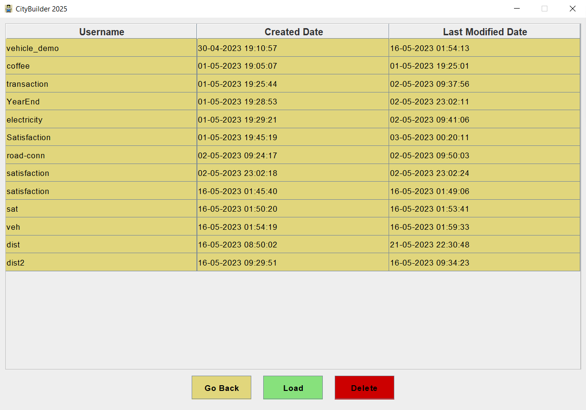

# City Builder 2025

CityBuilder2025 is a simple 2D GUI tycoon-like real-time city builder game implemented with vanilla Java SE.

## Description

The player is given a well-defined area consisting of square fields. They can build their own city in
this area and manage it as a mayor with wide powers. Overall, the city consists of different types of
zones (on which residents build automatically), service buildings to be built separately by the player,
and the roads connecting them. The player's goal is to develop a prosperous city where the citizens
are happy and the budget is balanced.

The player receives some starting capital for the initial construction of the city, but they must rely on
tax revenues for further developments. The game plays in real time, but time will pass much faster
compared to reality. The game should indicate the time (year, month, day), and it should be possible
to play the game in 3 different speeds, as well as to pause it.

The game has minimal 2-dimensional graphics viewed from top, where the fields are represented by
static images. The basic features are:

- Zones
- Service Buildings
- Roads
- Population
- Satisfaction
- Income and Expenses

Additionally, the following features and animations are included:

### Vehicles

Available to build the road in the city at a specific cost and the vehicles are rendered only on the road. 
The vehicle is animated with the canvas and rendered every millisecond to animate the movement of vehicles. 
The significant feature is that vehicles will never collide each other at the junction 
which is automated with the programming matrix model.

The animation is as follows:

### Disaster

Some natural or industrial disaster can occur rarely and randomly or at the
player's request. The character is referenced by [Attack On Titan Giant](https://en.wikipedia.org/wiki/Attack_on_Titan).

The animation is as follows:

### Persistence

It is also possible to save and load the game, and to manage multiple saves.

### Electricity

Every building in the city needs electricity. It is possible to build a power plant in a 2x2 area. The
power plant supplies the adjacent zone fields and service bulidings with electricity. All zone fields
and service buildings have a built-in electrical network for the transmission of electricity, so that it 
continues to spread through contiguous zones and service buildings. Electricity can be transmitted
between non-contiguous areas by building a high-voltage transmission line. In this case no other
construction can be done on these fields.

## Installation

JDK 11 has to be pre-installed before running. A maven project is already setup, so this can be run the same way maven is run.
The whole project can also be executed with a `javac` command to [Main.java](src/main/java/com/coffee/citybuilder/Main.java) as well. In this case, gson.jar file has to be pre-downloaded and pass it to the command.

## Developer Documentation

The whole game is implemented with **Model-View** architecture plus famous software engineering design pattern, singleton, with the approach to
_SOLID_, _DRY_ and _KISS_ principles.

The **game model** is represented as a 2-dimensional enum matrix implemented in model layer. 
The **persistence** featured is developed with local json I/O. 
**Animations** are drawn by real-world programming logic plus static picture and rendered in canvas. Breadth-first search algorithm is used to search a specific object in the game map.

The **test framework** is written in JUnit and the github workflow is implemented for the CI.

**The project is developed for university assignment by _Zayar Htet_, _Min Myat Zaw Moe_ and _Dominykas_.**
 
